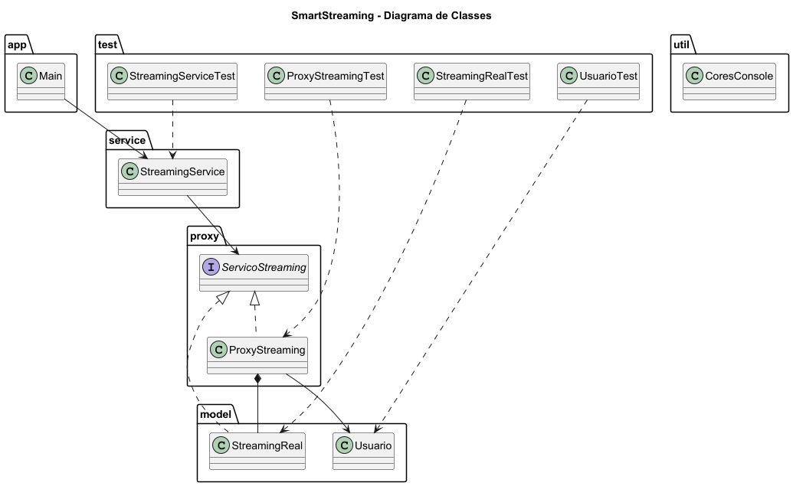

# SmartStreaming

Sistema de streaming desenvolvido em Java utilizando o padrão de projeto Proxy.

O projeto simula uma plataforma de streaming onde apenas usuários com assinatura ativa podem acessar conteúdos premium. O Proxy atua como intermediário entre o cliente e o serviço real, realizando a validação de acesso antes da execução da operação.

---

# Padrão de Projeto Utilizado

## Proxy

O padrão estrutural Proxy fornece um objeto substituto que controla o acesso a outro objeto.

### Estrutura do padrão no projeto

| Papel | Classe |
|---------|---------|
| Subject | ServicoStreaming |
| RealSubject | StreamingReal |
| Proxy | ProxyStreaming |
| Client | Main |

---

# Diagrama de Classes



---

# Funcionalidades

- Controle de acesso ao conteúdo premium
- Verificação de assinatura ativa
- Reprodução de conteúdo protegido
- Encapsulamento das regras de autorização
- Separação entre cliente e serviço real

---

# Estrutura do Projeto

```text
padrao-proxy/
│
├── src/
│   ├── main/
│   │   ├── app/
│   │   │   └── Main.java
│   │   │
│   │   ├── proxy/
│   │   │   ├── ServicoStreaming.java
│   │   │   └── ProxyStreaming.java
│   │   │
│   │   ├── model/
│   │   │   ├── Usuario.java
│   │   │   └── StreamingReal.java
│   │   │
│   │   ├── service/
│   │   │   └── StreamingService.java
│   │   │
│   │   └── util/
│   │       └── CoresConsole.java
│   │
│   └── test/
│       ├── UsuarioTest.java
│       ├── StreamingRealTest.java
│       ├── ProxyStreamingTest.java
│       └── StreamingServiceTest.java
│
├── docs/
│   └── diagrama-classe.png
│
├── README.md
│
└── .gitignore
```

---

# Tecnologias Utilizadas

- Java 17
- IntelliJ IDEA
- JUnit 5
- PlantUML
- Git

---

# Execução da Aplicação

Execute a classe:

```text
src/main/app/Main.java
```

---

# Execução dos Testes

Execute os testes localizados em:

```text
src/test
```

Pela IntelliJ:

- Clique com o botão direito na pasta `test`
- Run Tests

Ou utilizando Maven:

```bash
mvn test
```

---

# Casos de Teste Implementados

## UsuarioTest

- Criação de usuário assinante
- Criação de usuário não assinante
- Recuperação do nome

## StreamingRealTest

- Criação do serviço real
- Reprodução de conteúdo
- Execuções múltiplas

## ProxyStreamingTest

- Liberação para assinantes
- Bloqueio para não assinantes
- Criação do proxy

## StreamingServiceTest

- Criação da camada de serviço
- Reprodução para assinantes
- Reprodução para não assinantes
- Múltiplas reproduções

---

# Exemplo de Saída

```text
=== USUÁRIO ASSINANTE ===

Reproduzindo filme premium...

=== USUÁRIO NÃO ASSINANTE ===

Acesso negado.
Assinatura necessária.
```

---
